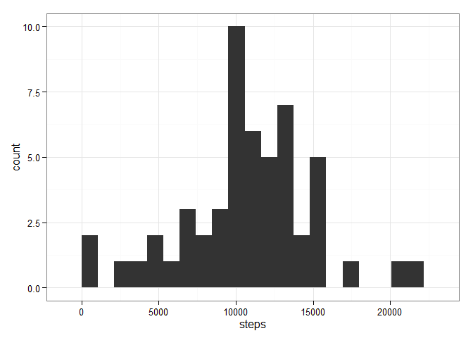

# Reproducible Research: Peer Assessment 1


## Loading and preprocessing the data
For this analysis I've loaded the *dplyr* and *ggplot2* libraries. To start, I simply read the activity monitoring data from a csv file, with no further processing:

```r
activity_raw <- tbl_df(read.csv('activity/activity.csv'))
print(activity_raw)
```

```
## Source: local data frame [17,568 x 3]
## 
##    steps       date interval
##    (int)     (fctr)    (int)
## 1     NA 2012-10-01        0
## 2     NA 2012-10-01        5
## 3     NA 2012-10-01       10
## 4     NA 2012-10-01       15
## 5     NA 2012-10-01       20
## 6     NA 2012-10-01       25
## 7     NA 2012-10-01       30
## 8     NA 2012-10-01       35
## 9     NA 2012-10-01       40
## 10    NA 2012-10-01       45
## ..   ...        ...      ...
```

## What is mean total number of steps taken per day?
One way to explore the dataset is by considering the steps taken each day:

```r
date_summary <- activity_raw %>% group_by(date) %>% 
    summarise(steps = sum(steps))
print(date_summary)
```

```
## Source: local data frame [61 x 2]
## 
##          date steps
##        (fctr) (int)
## 1  2012-10-01    NA
## 2  2012-10-02   126
## 3  2012-10-03 11352
## 4  2012-10-04 12116
## 5  2012-10-05 13294
## 6  2012-10-06 15420
## 7  2012-10-07 11015
## 8  2012-10-08    NA
## 9  2012-10-09 12811
## 10 2012-10-10  9900
## ..        ...   ...
```
From there, I can plot a histogram and find middle values for steps taken per day:

```r
steps_range <- diff(range(date_summary$steps, na.rm = TRUE))
g <- ggplot(date_summary, aes(steps)) 
g + geom_bar(binwidth = steps_range/20) + theme_bw()
```

 

```r
as.data.frame(summarise(date_summary
    , mean = mean(steps, na.rm = TRUE)
    , median = median(steps, na.rm = TRUE) 
))
```

```
##       mean median
## 1 10766.19  10765
```

## What is the average daily activity pattern?
Another useful view is activity during different time intervals throughout the day:

```r
interval_summary <- activity_raw %>% group_by(interval) %>% 
    summarise(avg.steps = mean(steps, na.rm = TRUE))

g <- ggplot(interval_summary, aes(interval, avg.steps)) 
g + geom_line() + labs(x = '5 minute interval', y = 'average steps') +
    theme_bw()
```

 
From here I can see that the maximum average steps occurs at interval 1705:

```r
as.data.frame(interval_summary[max(interval_summary$avg.steps
                                   , na.rm = TRUE), ])
```

```
##   interval avg.steps
## 1     1705  56.30189
```


## Imputing missing values
The dataset has many missing values, which can introduce bias. One way to compensate for these missing values is by filling in with the average steps for that interval. 

```r
sum(is.na(activity_raw))
```

```
## [1] 2304
```

```r
processed_df <- activity_raw
processed_df$id <- seq(1:nrow(processed_df))
temp <- tbl_df(merge(processed_df[is.na(processed_df), ], interval_summary, 
                     by = 'interval', all.x = TRUE)) %>% arrange(id)
processed_df[is.na(processed_df), 1] <- temp$avg.steps
processed_df
```

```
## Source: local data frame [17,568 x 4]
## 
##        steps       date interval    id
##        (dbl)     (fctr)    (int) (int)
## 1  1.7169811 2012-10-01        0     1
## 2  0.3396226 2012-10-01        5     2
## 3  0.1320755 2012-10-01       10     3
## 4  0.1509434 2012-10-01       15     4
## 5  0.0754717 2012-10-01       20     5
## 6  2.0943396 2012-10-01       25     6
## 7  0.5283019 2012-10-01       30     7
## 8  0.8679245 2012-10-01       35     8
## 9  0.0000000 2012-10-01       40     9
## 10 1.4716981 2012-10-01       45    10
## ..       ...        ...      ...   ...
```
Now I can make a histogram and view middle values as before:

```r
date_summary2 <- processed_df %>% group_by(date) %>% 
    summarise(steps = sum(steps))
g <- ggplot(date_summary2, aes(steps))
g + geom_bar(binwidth = steps_range/20) + theme_bw()
```

 

```r
as.data.frame(summarise(date_summary2
    , mean = mean(steps, na.rm = TRUE)
    , median = median(steps, na.rm = TRUE) 
))
```

```
##       mean   median
## 1 10766.19 10766.19
```
The histogram has skewed slightly right, and the median has increased slightly. 

## Are there differences in activity patterns between weekdays and weekends?
Since people tend to have different behaviors on weekdays and weekends, we can also see how activity differs on weekdays and weekends:

```r
processed_df$date <- as.Date(processed_df$date)
processed_df$day_descrip <- sapply(processed_df$date, function(x) {
    ifelse(weekdays(x) %in% c('Saturday', 'Sunday'), 'weekend', 'weekday')
})
processed_df
```

```
## Source: local data frame [17,568 x 5]
## 
##        steps       date interval    id day_descrip
##        (dbl)     (date)    (int) (int)       (chr)
## 1  1.7169811 2012-10-01        0     1     weekday
## 2  0.3396226 2012-10-01        5     2     weekday
## 3  0.1320755 2012-10-01       10     3     weekday
## 4  0.1509434 2012-10-01       15     4     weekday
## 5  0.0754717 2012-10-01       20     5     weekday
## 6  2.0943396 2012-10-01       25     6     weekday
## 7  0.5283019 2012-10-01       30     7     weekday
## 8  0.8679245 2012-10-01       35     8     weekday
## 9  0.0000000 2012-10-01       40     9     weekday
## 10 1.4716981 2012-10-01       45    10     weekday
## ..       ...        ...      ...   ...         ...
```

```r
interval_summary2 <- processed_df %>% group_by(interval, day_descrip) %>% 
    summarise(avg.steps = mean(steps, na.rm = TRUE))
g <- ggplot(interval_summary2, aes(interval, avg.steps)) 
g + geom_line() + labs(x = '5 minute interval', y = 'average steps') +  
    facet_wrap(~day_descrip, ncol = 1) + theme_bw()
```

 
